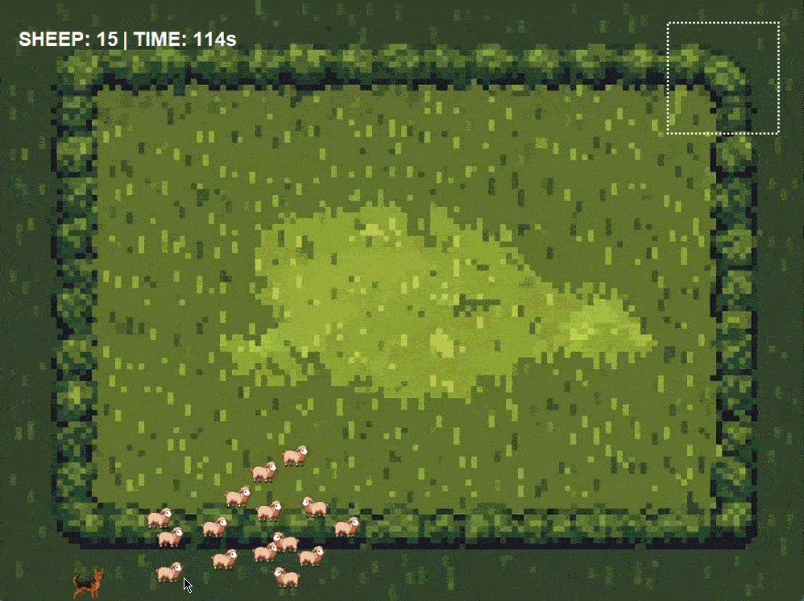

# boids-sheep-herder
# Boids-based Sheep Herder
Pythonとtkinterで制作した、ボイド（群れ）アルゴリズムを用いた羊追いアクションゲームです。

## 🎥 動作デモ

※犬（プレイヤー）を操作して、羊の群れを画面外へ誘導します。

## 🧠 このプロジェクトの技術的ポイント
このゲームでは、自然界の群れの動きを再現するために**「ボイド（Boids）アルゴリズム」**を独自に実装しました。

### 実装した3つの基本ルール
1. **分離 (Separation)**: 羊同士が近すぎると反発し、ぶつからないように動く。
2. **整列 (Alignment)**: 周囲の羊と同じ方向に動こうとする。
3. **結合 (Cohesion)**: 群れの中央に向かって集まろうとする。

これらに加え、**「プレイヤー（犬）から逃げる」**というベクトル演算を組み合わせることで、生き物のような滑らかな回避行動を再現しています。

## 🛠 使用技術
- **Language:** Python 3.11
- **Library:** tkinter, Pillow (PIL)
- **Logic:** ベクトル演算を用いたアルゴリズム実装

## 📂 ファイル構成
- `sheep_game.py`: ゲームのメインプログラム
- `assets/`: 画像素材（背景、羊、犬）
- `Sheep.gif`: 動作確認用のデモ画像

## 🎮 遊び方
1. リポジトリをクローンまたはダウンロードします。
2. `python sheep_game.py` を実行してください。
3. マウス（またはキーボード）で犬を操作し、羊を追いかけます。
## 🎥 動作デモ

