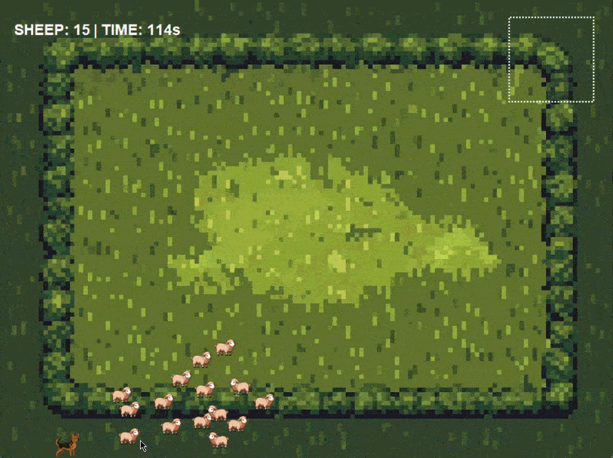

# Boids-based Sheep Herder
Pythonとtkinterで制作した、ボイド（群れ）アルゴリズムを用いた羊追いアクションゲームです。

## 🎥 動作デモ

※犬（プレイヤー）を操作して、羊の群れを誘導します。

## 🧠 技術的な見どころ：ボイド（Boids）アルゴリズム
このプロジェクトでは、以下の3つのベクトル演算を組み合わせることで、羊たちのリアルな群れの動きを実現しています。

1. **分離（Separation）**: 羊同士の衝突を避ける動き
2. **整列（Alignment）**: 周囲の群れと同じ方向に進む動き
3. **結合（Cohesion）**: 群れの中央に集まろうとする動き

これに「プレイヤーから一定距離で逃げる」ロジックを追加し、生き生きとした回避行動をプログラミングしました。

## 🛠 使用技術
- **Language:** Python 3.11
- **Library:** tkinter, Pillow (PIL)
- **Mathematical Logic:** ベクトル演算によるアルゴリズム実装

## 📂 ファイル構成
- `sheep.py`: ゲームのメインコード
- `Sheep.gif`: 動作デモ画像
- `dog.png` / `sheep.png` / `grass.jpg`: ゲーム内アセット

## 🎮 実行方法
1. Pythonがインストールされた環境で本リポジトリをクローンします。
2. 以下のコマンドでライブラリをインストールします（必要な場合）。
   `pip install Pillow`
3. プログラムを実行します。
   `python sheep.py`

🤖 To maximize development efficiency, this project fully utilized AI tools for code generation. On the other hand, I independently managed the vast majority of the development lifecycle—ranging from requirements definition, screen transitions, and feature design, to crafting precise prompts, integrating the generated code, and handling final debugging and quality assurance.

（本プロジェクトでは、開発効率を最大化するため、コードの自動生成にAIを全面的に活用しています。
一方で、要件定義、画面遷移や機能の設計、AIへの正確なプロンプト構築、出力されたコードの統合、および最終的なデバッグや動作検証に至るまで、開発プロセスの大半は自身が主体となって一貫して行いました。）
